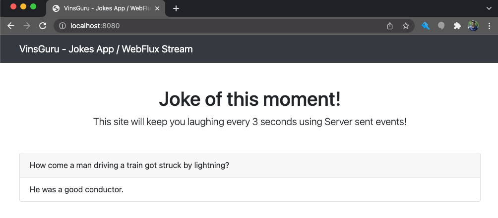

# WebFlux Streaming (Server Sent Events)

This is a sample application for demonstrating WebFlux Streaming Response (Event Stream / Server Sent Events).

For more info check [here](https://www.vinsguru.com/spring-webflux-streaming/).

When you run this application, it will show a joke as shown here. It will periodically update itself. (every 3 seconds)

